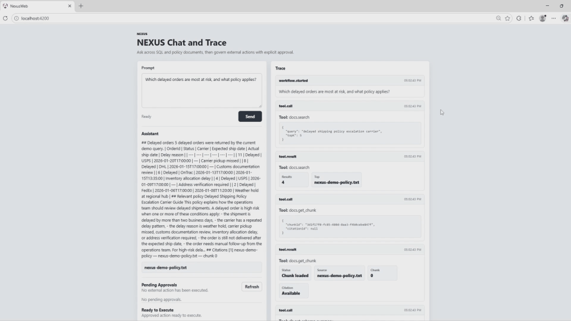
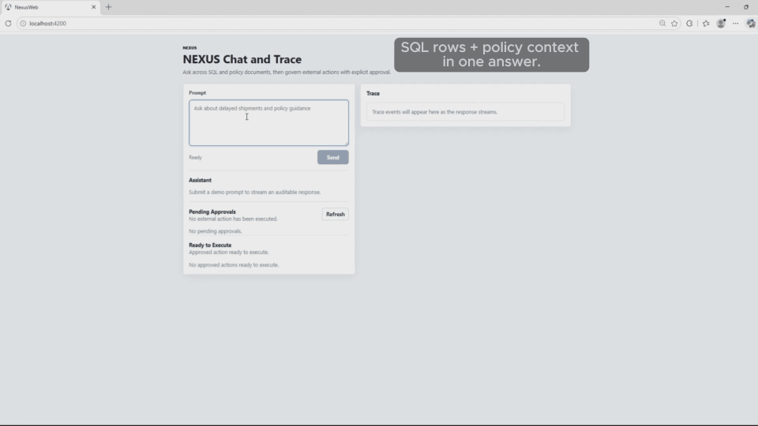
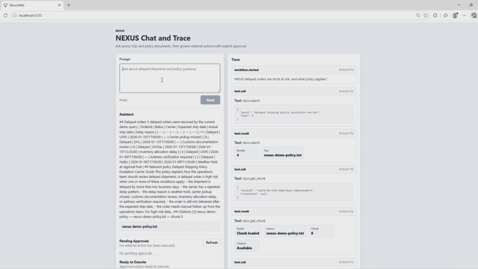
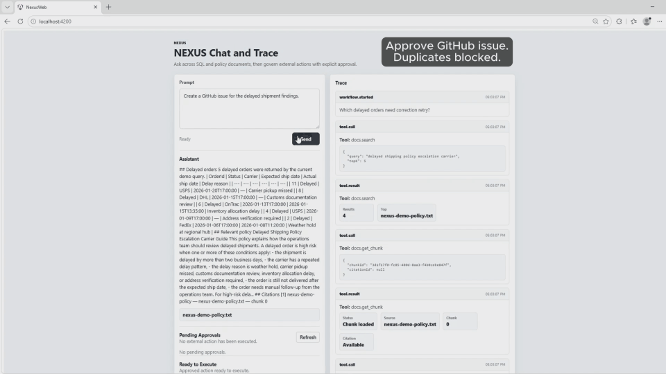

# NEXUS — Ask + Recover + Govern + Act

NEXUS is a .NET full-stack portfolio project that demonstrates how an AI-assisted internal operations tool can answer business questions from SQL data and policy documents, recover from bounded read-path mistakes, and execute external actions only after explicit human approval.

The project is intentionally not a broad autonomous agent. It is a governed workflow system with clear service boundaries, safe database access, sanitized trace events, persisted approvals, checkpoints, and approval-gated GitHub issue creation.

## Demo Preview

<p align="center">
  
</p>

NEXUS combines **SQL data**, **policy document retrieval**, **transparent trace events**, and **approval-gated external actions** in one end-to-end workflow. The preview shows the core story: ask across internal data and documents, recover safely from a read-path error, approve an external action, execute it explicitly, and block duplicate execution.

[Watch the full NEXUS portfolio demo](https://github.com/sanghunmok-prog/nexus-ask-act-hub/releases/tag/v1.0-demo)

## Key Features

- **Hybrid Ask Path** — answers operational questions using SQL Server data and retrieved policy document context.
- **Safe SQL Access** — user prompts never become raw SQL; reads go through `StructuredQuery`, allowlists, validation, and parameterized SQL.
- **Bounded Recovery** — recoverable read-path schema errors can be corrected once, with at most two `db.query_readonly` attempts.
- **Human-Gated Actions** — GitHub issue creation requires approval and a separate explicit execute action.
- **Auditable Workflow State** — approval requests and agent checkpoints persist the action lifecycle.
- **Sanitized Trace Timeline** — UI traces show tool names, sanitized arguments, document results, loaded chunks, schema lookup, SQL rows, retry state, approval state, and assistant summary metrics without exposing secrets or chain-of-thought.
- **Deterministic Local Demo** — `LLM_MODE=mock` keeps demos and tests stable without requiring live model credentials.

## Demo Highlights

### 1. SQL + Policy Document Answering

<p align="center">
  
</p>

NEXUS answers a business question by combining safe SQL reads with policy document retrieval. The trace shows `docs.search`, `docs.get_chunk`, schema lookup, `db.query_readonly`, and an assistant summary with SQL rows, document results, and citations.

**Why it matters:** this demonstrates more than a chatbot response. The answer is grounded in structured operational data and retrieved policy context, with traceable intermediate steps.

### 2. Safe One-Time Correction Retry

<p align="center">
  
</p>

When the first read query has a schema mismatch, NEXUS surfaces the validation failure, corrects the structured query once, and retries safely. The retry budget is bounded, so the workflow does not loop forever.

**Why it matters:** this shows defensive engineering. The system handles a recoverable read-path error without accepting raw SQL, hiding the failure, or retrying indefinitely.

### 3. Approval-Gated GitHub Execution

<p align="center">
  
</p>

GitHub issue creation is treated as an external write action. NEXUS creates an approval request first, moves the checkpoint to `ReadyToResume` after approval, executes only after an explicit user action, and blocks duplicate execution with `409 Conflict`.

**Why it matters:** this is the core governance boundary. Approval is not execution, and completed actions cannot be executed again to create duplicate GitHub issues.

## Demo Flow

The recommended demo flow is:

1. **Ask** — `Which delayed orders are most at risk, and what policy applies?`
2. **Recover** — `Which delayed orders need correction retry?`
3. **Govern** — `Create a GitHub issue for the delayed shipment findings.`
4. **Execute** — approve the pending action, show that approval is not execution, explicitly execute it, then confirm the GitHub issue URL.
5. **Guard** — retry the same execute request and show `409 Conflict`.

See [`docs/DEMO_SCRIPT.md`](docs/DEMO_SCRIPT.md) for the full recording script and command runbook.

## Architecture Overview

NEXUS is split into focused projects with explicit responsibility boundaries.

| Layer | Project | Responsibility |
|---|---|---|
| Frontend | `src/Nexus.Web` | Angular UI for prompt input, assistant answer, trace timeline, pending approvals, and ready-to-execute actions. |
| API / Workflow | `src/Nexus.OrchestratorApi` | POST-based SSE chat workflow, approval APIs, checkpoints, document upload/ingestion, and execution coordination. |
| Tool Execution | `src/Nexus.Mcp.Toolbelt` | Narrow tool endpoints for SQL reads, document search, document chunk lookup, and GitHub issue creation. |
| Contracts | `src/Nexus.Contracts` | Shared request/response contracts, including `StructuredQuery`. |
| Query Safety | `src/Nexus.QuerySafety` | Structured query validation, allowlist enforcement, and parameterized SQL compilation. |
| Embeddings | `src/Nexus.Embeddings` | Deterministic mock embedding provider for local document retrieval demos. |
| Local Orchestration | `src/Nexus.AppHost` | .NET Aspire AppHost for local service orchestration. |
| Service Defaults | `src/Nexus.ServiceDefaults` | Shared .NET service defaults. |
| Persistence | SQL Server | Orders, policy documents, document chunks, approvals, checkpoints, and audit records. |

### Runtime Boundary

```text
Browser
  -> Nexus.Web
  -> Nexus.OrchestratorApi
      -> SQL Server for workflow state, approvals, checkpoints, and documents
      -> Nexus.Mcp.Toolbelt
          -> SQL Server for safe read tools and document search
          -> GitHub Issues API for approved issue creation
```

The Orchestrator owns workflow and policy decisions. The Toolbelt executes constrained tools. The GitHub token belongs only to the Toolbelt process.

## Application Domains

NEXUS is organized around practical domain boundaries rather than a single monolithic API.

### API Domain

- `POST /api/chat/stream`
- approval endpoints
- document upload and ingestion endpoints
- health checks
- POST-based SSE response streaming consumed by Angular through `fetch + ReadableStream`

### Application Domain

- deterministic mock planner
- hybrid SQL + policy response composition
- approval/checkpoint lifecycle
- bounded read-path correction
- action gating rules
- trace event shaping

### Infrastructure Domain

- SQL Server persistence
- EF Core migration-compatible schema evolution
- deterministic SQL bootstrap/seed scripts for local demo data
- Toolbelt HTTP integration
- GitHub REST API integration
- environment-variable based process isolation

### Safety Domain

- `StructuredQuery` contract
- allowlisted tables and columns
- parameterized query compiler
- single-table MVP read boundary
- sanitized public errors
- no chain-of-thought, secrets, raw SQL, stack traces, or connection strings in UI/API responses

## Data Model

NEXUS persists three kinds of data:

| Area | Tables |
|---|---|
| Business data | `Orders` |
| Policy retrieval | `PolicyDocuments`, `PolicyChunks` |
| Governance | `ApprovalRequest`, `AgentCheckpoint`, `AuditLog` |

`PolicyChunks.Embedding` uses a `VECTOR(1536)` column for document retrieval. Local demos use deterministic mock embeddings to avoid requiring external embedding credentials.

See [`docs/DATA_MODEL.md`](docs/DATA_MODEL.md).

## Database Migration And Bootstrap

NEXUS keeps schema evolution and deterministic demo data separate:

- **Schema evolution** should be handled through EF Core migrations when the project branch includes migration metadata.
- **Local demo data** should remain deterministic and can be bootstrapped through SQL scripts under `infra/docker/sql/`.

Recommended EF Core migration command shape:

```bash
dotnet tool restore

dotnet ef database update \
  --project src/Nexus.OrchestratorApi \
  --startup-project src/Nexus.OrchestratorApi
```

If migrations live in a dedicated infrastructure project in your branch, use that project as `--project` and keep `src/Nexus.OrchestratorApi` as the startup project.

Local SQL bootstrap scripts live under:

```text
infra/docker/sql/
```

Typical local bootstrap order:

```text
001_schema.sql
002_seed_orders.sql
003_verify_orders.sql
```

## API Surface

### Orchestrator API

| Endpoint | Purpose |
|---|---|
| `POST /api/chat/stream` | Main prompt workflow and SSE trace. |
| `GET /api/approvals/pending` | Pending approval list. |
| `GET /api/approvals/ready` | Approved actions ready for explicit execution. |
| `POST /api/approvals/{approvalId}/approve` | Records approval and prepares checkpoint. |
| `POST /api/approvals/{approvalId}/reject` | Rejects approval and fails checkpoint. |
| `POST /api/approvals/{approvalId}/execute` | Executes an approved GitHub issue action. |
| `POST /api/documents/upload` | Uploads a text-based policy document. |
| `POST /api/documents/{docId}/ingest` | Embeds stored document chunks. |
| `GET /api/health` | Health check. |

### Toolbelt API

| Endpoint | Purpose |
|---|---|
| `GET /api/tools/db/schema-summary` | Returns allowlisted schema summary. |
| `POST /api/tools/db/query-readonly` | Executes validated read-only `StructuredQuery`. |
| `POST /api/tools/docs/search` | Searches embedded policy chunks. |
| `POST /api/tools/docs/get-chunk` | Loads a cited document chunk. |
| `POST /api/tools/github/create-issue` | Creates a GitHub issue after approval and explicit execute. |
| `GET /api/health` | Health check. |

See [`docs/API_CONTRACTS.md`](docs/API_CONTRACTS.md).

## Tech Stack

- .NET 10 minimal APIs
- .NET Aspire AppHost and ServiceDefaults
- Entity Framework Core migration-compatible persistence workflow
- Angular
- SQL Server local container
- SQL Server vector type for policy document chunk retrieval
- Deterministic mock embeddings
- GitHub REST API
- POST-based SSE using `fetch + ReadableStream`

## Local Quick Start

### Prerequisites

- .NET 10 SDK
- Node.js and npm
- Docker
- SQL Server 2025 / 17.x compatible local container for `VECTOR(1536)`
- Optional: `dotnet-ef` tool for EF Core migration commands

> Local note: the demo schema uses SQL Server `VECTOR(1536)`, so a fresh local bootstrap should use a SQL Server 2025 / 17.x compatible container. SQL Server 2022 does not support the `VECTOR` column used by `PolicyChunks`.

### Build And Test

```bash
dotnet build Nexus.slnx
dotnet test Nexus.slnx

cd src/Nexus.Web
npm install
npm run build
npm test -- --watch=false
```

### Run With Aspire AppHost

```bash
dotnet run --project src/Nexus.AppHost
```

In another terminal:

```bash
cd src/Nexus.Web
npm start
```

Open the Angular app:

```text
http://127.0.0.1:4200
```

## Environment Variables

See [`docs/ENVIRONMENT.md`](docs/ENVIRONMENT.md) for details.

| Variable | Process | Purpose |
|---|---|---|
| `NEXUS_SQL_CONNECTION_STRING` | Orchestrator, Toolbelt | SQL Server persistence. |
| `NEXUS_TOOLBELT_BASE_URL` | Orchestrator | Toolbelt base URL. |
| `LLM_MODE` | Orchestrator | Use `mock` for deterministic local demos. |
| `NEXUS_DEMO_GITHUB_REPO` | Orchestrator | Demo repo for issue creation requests. |
| `NEXUS_GITHUB_TOKEN` | Toolbelt only | GitHub issue creation token. |
| `NEXUS_GITHUB_ALLOWED_REPOS` | Toolbelt only | Repo allowlist for GitHub writes. |

Important: do not configure `NEXUS_GITHUB_TOKEN` in the Orchestrator process.

## Security Boundaries

- No raw SQL input is accepted from users.
- SQL reads use `StructuredQuery`, allowlists, and parameterized compiler output.
- MVP SQL reads are single-table only.
- Approval is required before external writes.
- Approve does not execute; execute is a separate explicit action.
- GitHub issue execution is limited to configured allowed repositories.
- Duplicate execute is blocked by an atomic checkpoint claim.
- GitHub write actions are not automatically retried.
- GitHub token configuration is isolated to Toolbelt.
- SSE and API responses must not expose secrets, chain-of-thought, raw SQL, stack traces, connection strings, or raw GitHub response bodies.

See [`docs/SECURITY.md`](docs/SECURITY.md).

## Final Smoke Checks

Use [`docs/FINAL_SMOKE_CHECKLIST.md`](docs/FINAL_SMOKE_CHECKLIST.md) before publishing or recording.

Primary checks:

```bash
dotnet build Nexus.slnx
dotnet test Nexus.slnx

cd src/Nexus.Web
npm run build
npm test -- --watch=false
```

Demo checks:

- normal read path returns delayed orders and policy citations
- correction retry emits `tool.retry` and stops within budget
- GitHub action creates a pending approval
- approve moves the action to ready-to-execute
- execute creates a GitHub issue
- duplicate execute returns `409`
- secret grep finds no committed tokens

## Known Limitations

- This is a portfolio/demo project, not a production platform as-is.
- Local demos are mock-first; live model integration is not required.
- Only GitHub issue creation is implemented as an external write action.
- No production SSO, RBAC, or multi-tenant authorization is included.
- OCR for scanned PDFs is out of scope.
- SQL reads are intentionally narrow and single-table for the MVP.
- Azure deployment documentation is a readiness guide, not proof of an existing deployed environment.

## Documentation

- [`docs/README.md`](docs/README.md)
- [`docs/ARCHITECTURE.md`](docs/ARCHITECTURE.md)
- [`docs/API_CONTRACTS.md`](docs/API_CONTRACTS.md)
- [`docs/DATA_MODEL.md`](docs/DATA_MODEL.md)
- [`docs/SECURITY.md`](docs/SECURITY.md)
- [`docs/ENVIRONMENT.md`](docs/ENVIRONMENT.md)
- [`docs/DEMO_SCRIPT.md`](docs/DEMO_SCRIPT.md)
- [`docs/FINAL_SMOKE_CHECKLIST.md`](docs/FINAL_SMOKE_CHECKLIST.md)
- [`docs/AZURE_DEPLOYMENT.md`](docs/AZURE_DEPLOYMENT.md)
