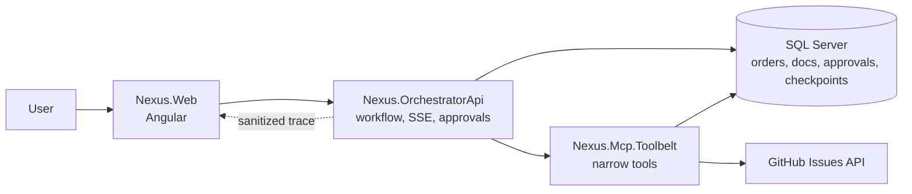
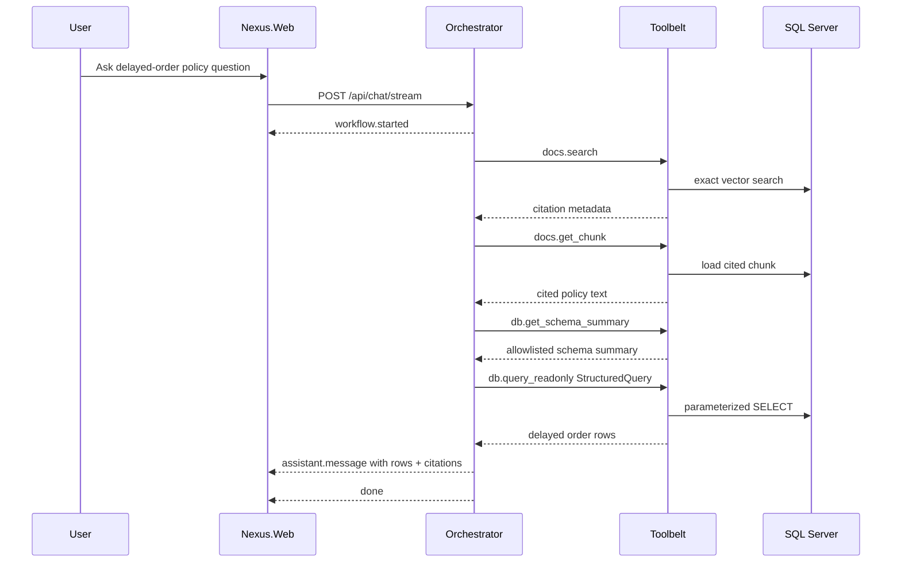
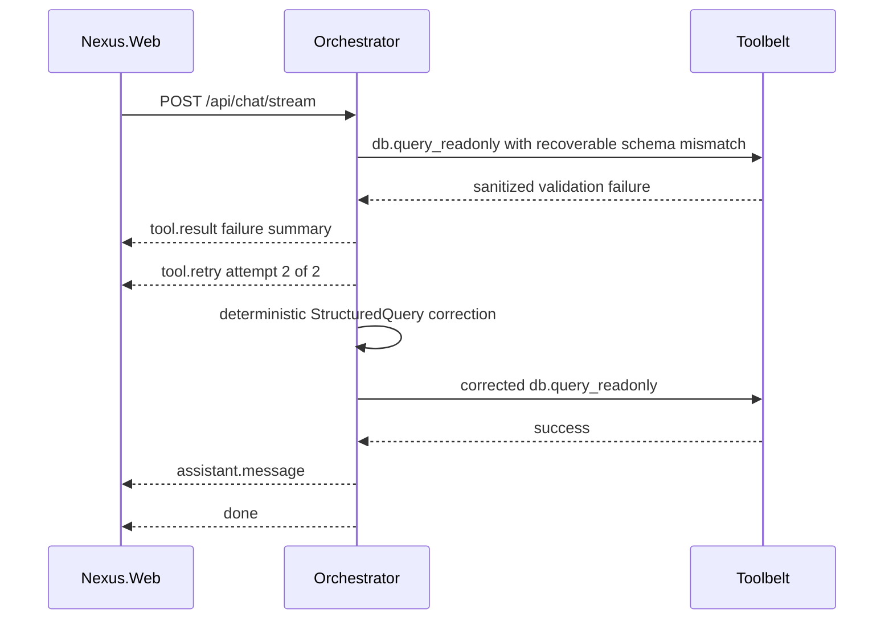
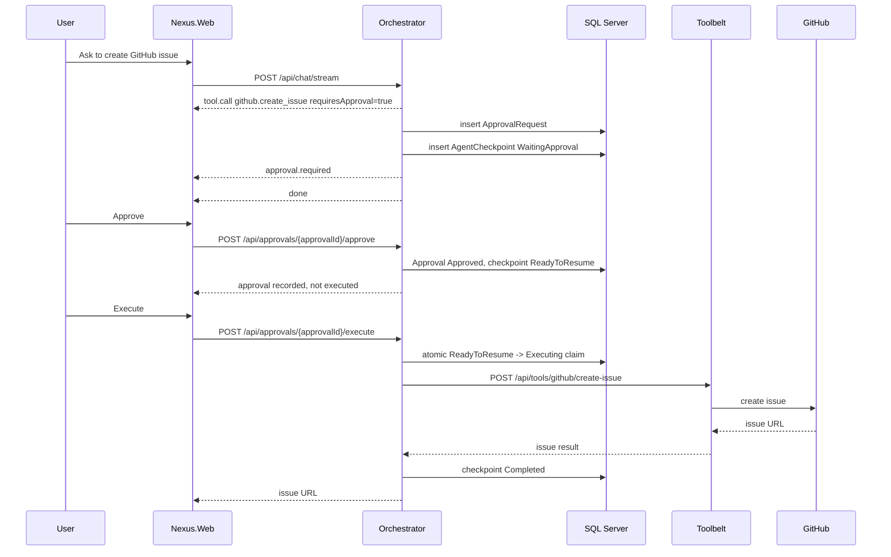

# Architecture

NEXUS is organized around a narrow Orchestrator + Toolbelt split. The Orchestrator owns workflow and governance decisions. The Toolbelt owns constrained tool execution.

## High-Level Component Architecture

Key boundaries:

- Browser talks to Orchestrator, not Toolbelt.
- Orchestrator calls Toolbelt through `NEXUS_TOOLBELT_BASE_URL`.
- GitHub token belongs only to Toolbelt.
- SQL reads use StructuredQuery and allowlisted compiler paths.

## Read Path Flow

## Correction Retry Flow

Rules:

- Retry applies only to recoverable read-path schema/allowlist failures.
- Retry budget is one correction retry, two total `db.query_readonly` attempts.
- Correction never bypasses Toolbelt validation or StructuredQuery safety.
- Write actions are not retried.

## Approval-Gated Action Flow

Duplicate execute attempts fail with `409` because the checkpoint is no longer `ReadyToResume`.
