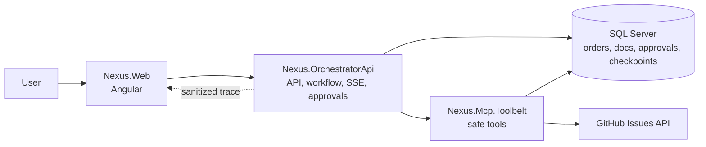
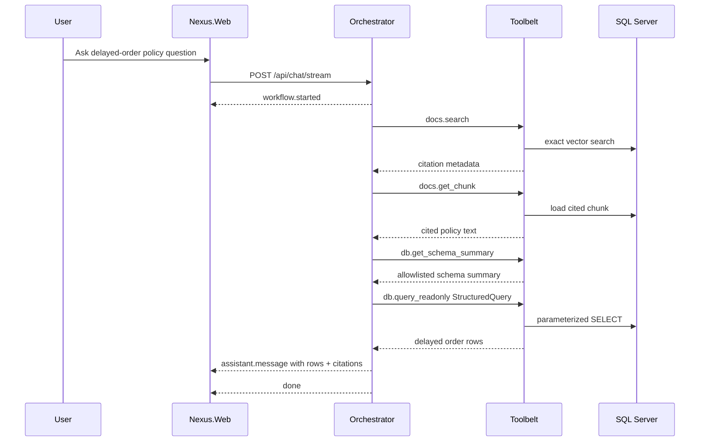
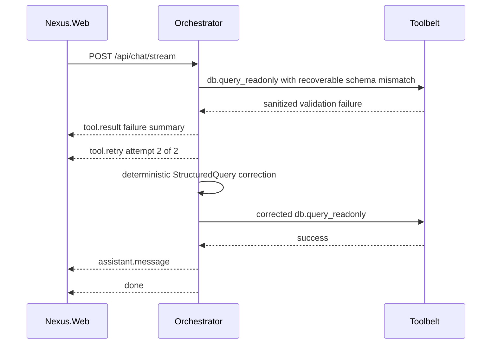
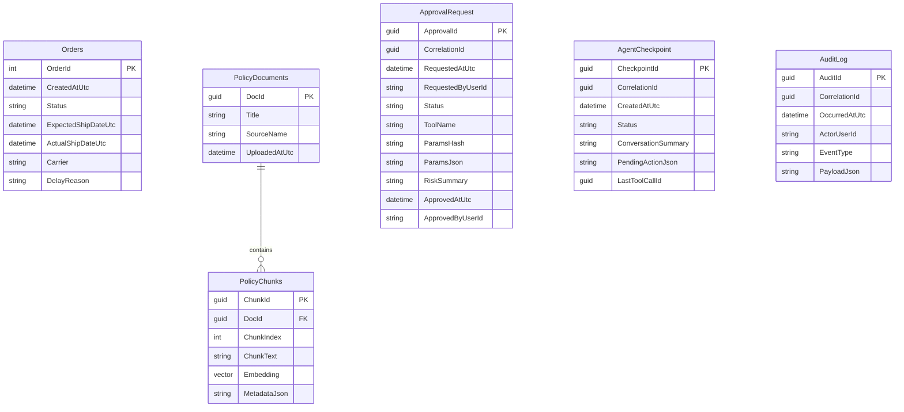

# Architecture

NEXUS is organized around a narrow Orchestrator + Toolbelt split.

The Orchestrator owns workflow, governance decisions, streaming trace events, approvals, and checkpoints. The Toolbelt owns constrained tool execution, including safe SQL reads, document retrieval, and GitHub issue creation.

## Component Architecture



## Runtime Services

| Service | Responsibility |
|---|---|
| `Nexus.Web` | Angular UI for prompt input, assistant answer, trace timeline, pending approvals, and ready-to-execute actions. |
| `Nexus.OrchestratorApi` | Main API boundary. Owns prompt workflow, POST SSE, approvals, checkpoints, document upload/ingestion, and explicit execution coordination. |
| `Nexus.Mcp.Toolbelt` | Tool execution host. Exposes SQL read, document search, chunk lookup, and GitHub issue tools. |
| SQL Server | Stores business data, policy documents, chunks, approvals, checkpoints, and audit records. |
| GitHub Issues API | External write target for the approved `github.create_issue` action. |

## Project Responsibility Map

| Project | Domain |
|---|---|
| `src/Nexus.Web` | Frontend |
| `src/Nexus.OrchestratorApi` | API + application workflow |
| `src/Nexus.Mcp.Toolbelt` | Infrastructure-facing tool execution |
| `src/Nexus.Contracts` | Shared contracts |
| `src/Nexus.QuerySafety` | SQL read safety |
| `src/Nexus.Embeddings` | Embedding provider abstraction |
| `src/Nexus.AppHost` | Local orchestration |
| `src/Nexus.ServiceDefaults` | Shared service defaults |

## Boundary Rules

- Browser talks to Orchestrator, not Toolbelt.
- Orchestrator calls Toolbelt through `NEXUS_TOOLBELT_BASE_URL`.
- GitHub token belongs only to Toolbelt.
- Orchestrator owns approval policy.
- Toolbelt executes tools but does not decide governance.
- SQL reads use `StructuredQuery`, allowlists, and parameterized compiler output.
- External writes require approval and explicit execute.

## Ask Path: SQL + Policy Documents



## Recover Path: Bounded Read Correction



Rules:

- Retry applies only to recoverable read-path schema/allowlist failures.
- Retry budget is one correction retry.
- At most two `db.query_readonly` attempts are allowed.
- Correction never bypasses Toolbelt validation or QuerySafety.
- Write actions are never retried automatically.

## Govern Path: Approval-Gated GitHub Issue

```mermaid
sequenceDiagram
    participant U as User
    participant W as Nexus.Web
    participant O as Orchestrator
    participant DB as SQL Server
    participant T as Toolbelt
    participant G as GitHub

    U->>W: Ask to create GitHub issue
    W->>O: POST /api/chat/stream
    O-->>W: tool.call github.create_issue requiresApproval=true
    O->>DB: insert ApprovalRequest
    O->>DB: insert AgentCheckpoint WaitingApproval
    O-->>W: approval.required
    O-->>W: done

    U->>W: Approve
    W->>O: POST /api/approvals/{approvalId}/approve
    O->>DB: Approval Approved
    O->>DB: Checkpoint ReadyToResume
    O-->>W: approval recorded; not executed

    U->>W: Execute
    W->>O: POST /api/approvals/{approvalId}/execute
    O->>DB: atomic ReadyToResume -> Executing claim
    O->>T: POST /api/tools/github/create-issue
    T->>G: Create issue
    G-->>T: issue number + URL
    T-->>O: issue result
    O->>DB: checkpoint Completed
    O-->>W: issue number + URL
```

Duplicate execute attempts fail with `409 Conflict` because the checkpoint is no longer `ReadyToResume`.

## Persistence Overview



## Design Tradeoffs

| Decision | Reason |
|---|---|
| POST SSE with `fetch + ReadableStream` | The chat stream accepts a JSON request body, so `EventSource` is not the right primary client pattern. |
| Mock-first local mode | Keeps demos and tests deterministic without requiring live model credentials. |
| StructuredQuery instead of raw SQL | Enforces allowlists, single-table MVP reads, and parameterized compiler output. |
| Approve is not execute | Separates human decision from external side effect. |
| Toolbelt-only GitHub token | Keeps external write credentials out of Orchestrator. |
| No write retry | Prevents duplicate external side effects. |
